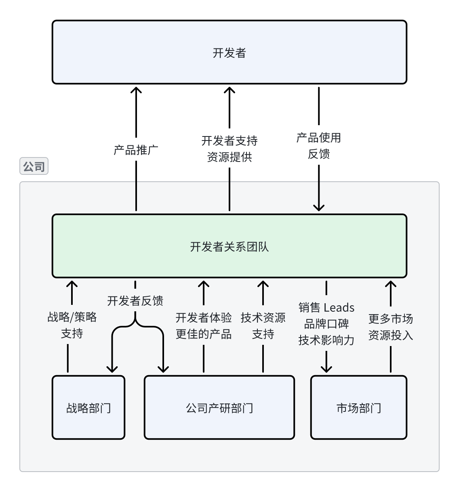
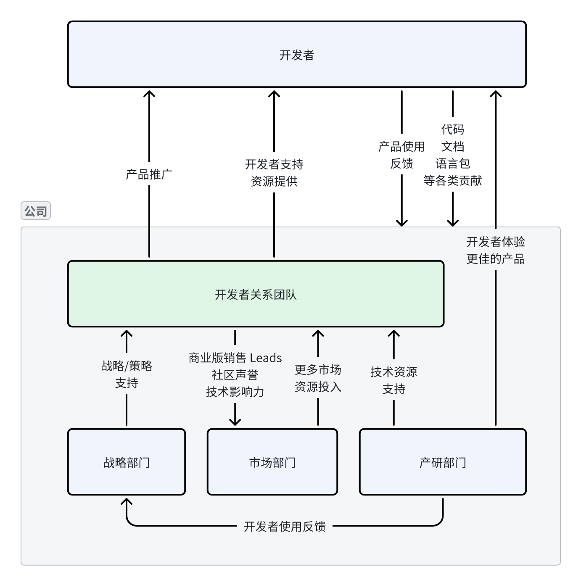
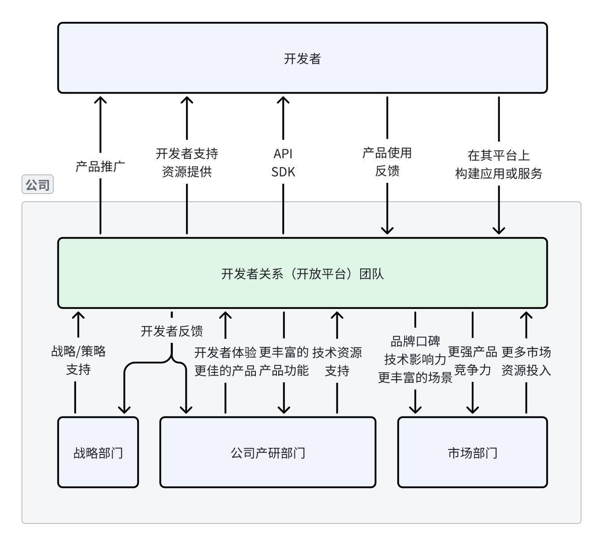
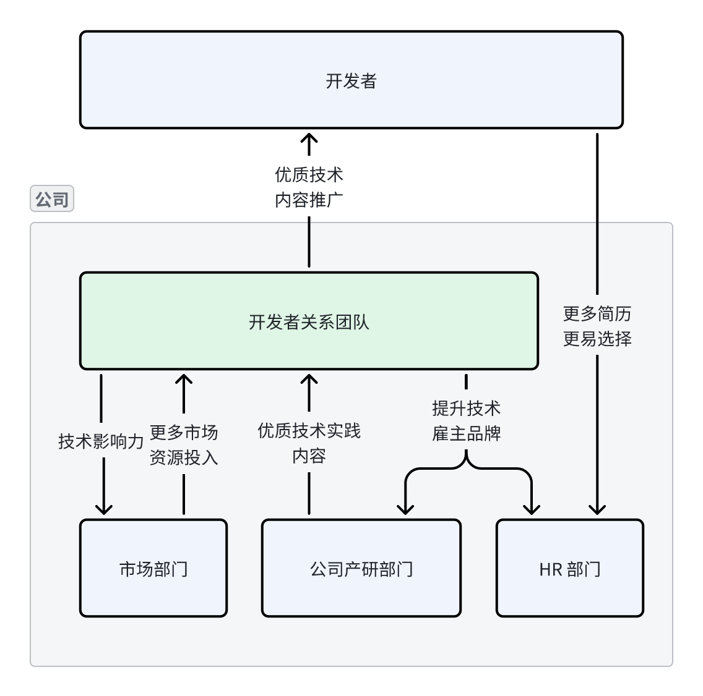

# Ⅱ.定义开发者关系
## 1 . 开发者关系综述

提到一家公司的对外关系，有两个已经被公众广泛听闻和熟知的概念，即**公共关系（Public Relations，简称 PR）**和**政府关系（Government Relations，简称 GR）**。

开发者关系（Developer Relations，简称 DevRel）和这两者类似，都是公司与其关键利益相关者建立并维护关系的方式，它们都强调了建立信任和理解的重要性，以促进长期的共赢关系，而开发者关系团队就在其中发挥了纽带的作用。

我们访谈了部分开发者关系的一线从业者，对于开发者关系的定义，他们给出了如下答案 ——

> **关键词：产品采用，开发者支持，用户粘性，技术影响力，影响采购决策** 
> 开发者关系是组织与外部开发者之间建立、维护和深化关系的业务。 若在组织的商业模式设计中，开发者是其中不可或缺的要素，则必须考虑开发者关系。 开发者关系是以增强其商业价值为前提，组织所建立的一套包含营销、技术、支持、运营的业务系统，以吸引、激励和支持开发者采用组织提供的产品、技术或服务，并为开发者提供必要的资源和支持，以形成用户粘性和技术影响力，进而成为领域的事实标准或行业默认采购选项之一。 —— 林旅强，零一万物开源负责人，开源社联合创始人，前华为云 AI 开发者生态总监

> **关键词：开发者支持，合作创新** 
> 从企业的角度，开发者关系可以被理解为企业与开发者、技术爱好者和其他技术专业人员之间的互动和合作关系。这种关系的主要目的是帮助开发者构建和扩展他们的技能，以及促进他们与企业之间的合作和创新。 —— 辛庆，微软 Reactor China Lead，开源社理事， PyChina 核心组织者

> **关键词：双向沟通，开发者成功+产品成功的双赢** 
>开发者关系是具有多重含义的，是企业和开发者双向奔赴和彼此成就的关系。 —— 段少婷，OceanBase 高级社区经理

> **关键词：双向沟通，提升开发者体验，开发者成功+产品成功的双赢** 
>开发者关系团队通常扮演的是公司和开发者之间的“桥梁”。 他们面向公司内部，代表的是开发者的声音，而面向开发者，则代表了公司的声音。因为这个桥梁的搭建，使得公司和开发者之间能够紧密沟通，从而帮助 2D 产品获得更优的用户体验，帮助开发者更快的实现开发/产品成功，最终实现双赢。 —— 马小茜，前声网生态中心开发者生态负责人

通过以上一线工作者的理解，我们可以看到几个被高频提到的关键词：双向沟通、产品采用、开发者体验、开发者成功、双赢、公司技术影响力等，这大多与企业构建开发者关系的目标成果相关。

因此，要进一步理解开发者关系的要义，我们需要先尝试理解什么类型的公司需要构建并发展开发者关系，以及他们的目标。

## 2. 不同类型组织构建开发者关系的背景和目的

**开发者关系**所面向的目标对象大体可以分为两类：

- 企业内部的开发者（企业内部的工程师）
- 企业外部的开发者（用户/客户/开源项目的外部贡献者等）

在中国，有少数科技公司设有面向内部的 DevRel 部门，它们有时设立在 HR 部门中，有时会设立独立的部门（如技术生态与发展部或技术学院），隶属于企业 CTO 办公室或技术委员会。其目标为打造良好的企业工程师文化，提升工程师的工作体验，以及通过一系列培训或活动帮助工程师不断精进，并以此驱动企业技术创新。

除此之外，大多数情况谈及 DevRel 一般是指代面向企业外部的开发者。而同样是面对外部的开发者，企业和开发者之间的关系也会因为业务类型、产品类型的不同而有所区别。

> 有些企业和开发者是生态合作伙伴的关系，有些企业和开发者是服务提供者与用户的关系，有些企业或项目和开发者是共创的关系……开发者关系本质上是在维护其与不同角色开发者的关系，并通过不断提升开发者的满意度，来提升产品采用率，推动技术创新从而实现业务价值。 —— 郭悦，亚马逊云科技资深开发者运营专家

>有效的开发者关系，一定是回到这个受众群体对于企业来说产生的最终价值。这背后也取决于我们如何看待开发者，把开发者视为是我们产品的消费者，那么开发者关系就等同于客户关系，核心是最终带来的收入；如果把开发者视为伙伴，那最重要的就是开发者基于我们企业产品和技术所衍生开发的可以填补生态布局空缺点的成果，当然也包括基于开发者自身业务所带动的企业产品收入（因为这些产品使用了我们的服务）。 —— 徐毅，华为云开发者联盟开发者技术布道师，DTSE 教练助理首席专家

按照不同的业务类型、组织与开发者的不同关系，我们尝试将企业构建开发者关系的目的分为以下几类，并梳理了不同类型公司的开发者关系团队内外部协作流程图：

### 2.1 **云服务、开发者工具、基础软件提供商：开发者是用户和客户**

他们提供的产品和服务直接面向开发者，如：云计算、开发工具、操作系统、数据库、中间件、人工智能和机器学习框架、大语言模型等，这些产品为应用软件的开发和运行提供了必要的环境和服务。

这类公司的核心目标是触达和影响公司目标的开发者群体，推广公司领先的产品或服务，提升产品采用，并提供所需工具、资源和支持，使开发者能够有效地用好相关产品或服务。

此外，开发者关系团队也是公司收集产品反馈，发现问题并进行改进的重要途径。通过建立和维护一个健康、活跃的开发者社区，将有助于帮助公司产品形成良好的口碑和二次传播，同时进一步影响到更多公司目标的开发者群体，不断吸引新的开发者加入。

*开发者关系团队内外部协作流程图 1*

> 2014-2015 年，我所在的公司是 GitCafe 代码托管平台，当时愿意投入人力和成本做开发者关系，因为公司产品服务的主打对象就是使用 Git 进行托管和协作的开发者。 2016-2023 年，我曾在华为先后担任开发者社区总监、IoT 操作系统 LiteOS 开源总监以及华为云 AI 开发者生态总监等。华为投入开发者关系，早期是“被集成战略”，因此做了开放 API、SDK 及远程实验室 OpenLab 等接口、工具和服务，让生态伙伴及其开发人员在集成华为能力时体验更好；近期则是因为华为云希望能让更多开发者在华为云上用的更多、构建更多应用，所以需要通过开发者关系工作来完成这个使命。 —— 林旅强，零一万物开源负责人，开源社联合创始人，前华为云 AI 开发者生态总监

> 对于数据库这样的基础软件，它的研发和成熟应用，需要长期的投入和较长的迭代周期，而通过与开发者的社会化协同，开发者可以帮助软件更快的应用起来，促进产品的成熟和落地，同时完善上下游生态。 —— 段少婷，OceanBase 社区负责人

### 2.2 开源软件提供商：开发者是贡献者、用户和潜在客户
他们的主要业务是提供开源软件的支持和服务，如：DataBricks，Confluent，PingCAP 等。通常这类公司会与上一类别存在一定的重叠，因为开源代码是直接面向开发者的，用户需要具备一定的编程知识才能理解、修改和分发源代码。然而开源代码编译和部署后的产品，所服务的受众可以非常广泛，因此我们单独设立了一个类别。
这类公司需要与开发者社区紧密合作，因为他们的产品往往由社区的开发者共同开发和维护。同时，和上一类别类似，其核心目标也包括扩大产品影响力和采用率、收集用户反馈以及推广他们的商业化产品和服务。

*开发者关系团队内外部协作流程图 2*

> 站在开源项目运营的角度上来看，开发者关系团队在开源项目中扮演重要的角色，他们与开发者社区紧密合作，提供技术支持、培训、文档和示例代码等资源，以便开发者能够更好地理解相关的代码和贡献到开源项目中。开发者关系团队还可以与开源社区合作，通过积极参与开源社区，开发者关系团队能够获取反馈、吸引新开发者、提高产品的可靠性和用户满意度，同时也能够提升公司或组织在开源社区中的声誉和影响力。 —— 姜宁，Apache 软件基金会 2022-2023 年度董事，ALC Beijing 发起人

### 2.3 Open Ecosystems Platform：开发者是生态构建者
他们的产品面向不局限于开发者的广大用户，但他们提供了开放的 API 或 SDK 和开发工具让开发者可以在他们的平台上构建并分发应用或服务。
这一类别涉及的公司业务类型很广泛，既包括 Salesforce，飞书，Slack，Twitter 和 Facebook 等提供开放平台的软件公司，也包括提供了自己的应用商店平台的苹果、华为、OPPO、vivo 等硬件制造商，区块链和加密货币公司也可以被视为一种特殊的 Open Ecosystems Platform，拿以太坊为例，它为开发者提供了一套全面的开发工具，包括 Solidity（一种智能合约编程语言）和 Truffle（一套以太坊开发框架），开发者可以在其上构建和运行智能合约和 DApps。
这类公司核心目标是触达和吸引开发者在其平台上构建应用或服务，进一步丰富平台的功能，创造出新的应用场景，从而增加平台的价值，提高平台的活跃度，并增强用户对平台的粘性。

*开发者关系团队内外部协作流程图 3*

### 2.4 泛科技公司：开发者是潜在雇员
国际上顶级的科技企业（既包括互联网公司，也包括如金融科技、电信、汽车等传统行业）都会在开发者关系上有所投入，以彰显其领先的技术实力、开放的创新氛围，并以此吸引和保留开发者人才，提升雇主品牌。国内比较领先的案例如：美团技术学院，美团会在社区中定期分享来自美团工程师的一线技术实践，涵盖前端（Web、iOS 和 Android）、后台、大数据、AI/算法、测试、运维等技术领域。截至 2023 年 12 月，美团技术团队已经发布了 570 多篇技术文章，在 SegmentFault 思否社区有数万名粉丝，最热门的一篇文章已经拥有超过 70.9k 阅读量，收获了 683 次点赞。

*开发者关系团队内外部协作流程图 4*

## 3. 开发者关系及相关名词概念

通过分析不同类型企业投入开发者关系的背景和目的，我们发现企业的开发者关系构建主要是围绕以下几个方面展开的：

- 不断提升开发者体验，增强产品竞争力
- 建立和运营活跃的开发者社区，增强开发者参与度、用户粘性
- 构建一个健康的开发者生态，最终作用于业务增长

这几部分的工作往往有所交叠，但又有各自侧重的不同方面。接下来我们将围绕开发者体验、开发者社区、开发者生态的定义、与开发者关系的关联及其相关概念逐一展开。

### 3.1 开发者关系（DevRel）与开发者体验（Developer Experience， DX）

#### 3.1.1 开发者体验的定义

根据 Kenneth Auchenberg 在 Developer Experience Infrastructure （DXI） 一文中的定义（原文链接：[https://kenneth.io/post/developer-experience-infrastructure-dxi](https://kenneth.io/post/developer-experience-infrastructure-dxi)），开发者体验是在开发者与你的产品或服务互动的整个生命周期中提供给开发者的全面体验。

具体来说，这一体验涵盖了一系列的内容，此处我们引用了此前陈梓立（tison）在其文章夜天之书 \#64 开发者体验的基础设施中的总结（原文链接：[https://mp.weixin.qq.com/s/u9t-bP2lOxWOqqM6Qz79JQ](https://mp.weixin.qq.com/s/u9t-bP2lOxWOqqM6Qz79JQ)）：

1. **产品体验**
   1. Onboarding：上船体验，判断是否应该尝试这个产品。例如，我正在找一个消息队列的方案，从 Apache Pulsar 的官方网站上看到它是一个云原生分布式的消息平台，再从它对消息概念的定义判断是否符合我的生产要求。
   2. Scaffolding：快速搭建项目的能力。前端项目对这一点通常做得很好，大都提供了一键创建样板项目的手段，例如 Next.js 的 yarn create next-app 命令。后端项目当中，Spring Boot 生态的 Spring Initializer 是一个有口皆碑的杀手特性，Apache Flink 也基于 Maven Archtype 的功能提供了快速搭建 Flink 应用模板的能力。
   3. API Design：好的 API 设计通常是正交的、自解释的且符合直觉的。坏的 API 设计要么是一个接口办了好几件事情，用户需要拆开而无法拆开；要么是几个接口办类似的事情，但是又都办得不好，用户用哪个都解决不了自己的问题；要么是缺斤少两，重要用户交互或管控功能没有对外暴露，功能缺失；最糟糕的情况是命名随意，从接口及其参数名称上根本搞不懂这个接口是干啥的。
   4. 错误信息：这里主要的原则是阅读错误信息应该是不需要思考的，即错误信息应该以开发者理解的语言直白的表达。TiDB 有一个著名的反例：对于一个查询返回 ERROR 9005 (HY000): Region is unavailable 提示。这个信息对于大多数用户来说都是不可理解的，总是需要 DBA 专门解释。
   5. UI 的视觉体验和可交互性：UI 控件的选择和反馈是不是符合直觉的，点击和数据加载在视觉反馈上是否及时。典型的正面例子是 ClickHouse 在执行查询的时候，总是会先反馈预期的查询计划概要，并且实时反馈处理进展。由于分析查询大多是复杂查询，这样的设计不至于让用户在相当的等待处理时间中无法判断到底是查询耗时较长，还是已经卡死。
   6. Dashboard：Flink 提供了 Apache Flink Web Dashboard 界面，Pulsar 提供了 Apache Pulsar Manager 软件。对于应用开发者来说，一个包含关键指标和状态的仪表盘能够极大的提升生产力。
   7. 可观测性、监控告警和数据指标：典型的是与 Prometheus 或 Grafana 等系统的集成。
   8. 源代码版本管理、代码搜索、代码评审和合作开发。
   9. CI/CD 和测试：这方面的工具就非常多了，可以说是 DXI 早已落地的一个领域。源代码托管的 GitHub 平台，SourceGraph 代码搜索、Gerrit 或 TeamCity 代码评审、CircleCI 或 Jenkins 的测试、持续集成和持续发布等等。
   10. 开发者工具：编辑器、命令行工具、实用工具和集成开发环境等：例如，新工具与 VS Code 或 Jetbrains IDE 的插件集成；redis-cli 或 etcdctl 这样设计良好的命令行工具；Pulsar 发布包里 bin 目录下一系列的实用工具。

2. **文档体验**
   1. API 参考文档：对于开发者来说，最后一公里就是 API 参考文档或 DSL 语法文档。开发调试 Flink SQL 作业几乎离不开 Flink SQL 的语法文档，尤其需要反复查阅是如何写对窗口。运维 Pulsar 总是需要随时查看命令行工具的使用手册，以及 Admin REST API 的参考文档。利用 pandas 开发数据处理应用的时候，经常需要搜索怎么做某个特定的数据变换。幸运的是，API 文档往往和接口定义和注释紧密结合，同样已经有不少 DXI 可以直接生成 API 参考文档。
   2. 教程、指南和典型用例：这个无需多言。Spring 生态面对各种需求的海量指南 Spring Guides 就是最佳学习对象。它解决的是软件产品或服务在现实世界里如何真正起作用的问题，比如以书店为例，基于 Spring 生态如何搭起来一个 RESTful 的 Web 应用。对于基础软件比如 Apache ZooKeeper 和 Redis 来说，则会提供类似分布式选主和限流器的典型用例。
   3. 概念定义和名词解释：Apache Pulsar 的创造者们对消息系统的理解是非常深刻的。因此，在官方网站上有 Pulsar 对消息系统的建模和关键概念的定义和解释。同样，TiDB 架构图对每个组件及其关键概念也各有解释。这样开发者才能触类旁通的阅读其他文档，以及与其他社群成员沟通。
   4. FAQ 和疑难杂症手册：常见的报错，常见的错误配置，常见的误用，以及如何解决这些问题。此外，还有回答“为什么不做 X 功能”，“跟 Y 软件对比有什么异同”等疑问。
   5. 版本策略与迁移指南：软件、产品和服务都不会永远维护，实施人员从任一个版本升级/回滚到指定版本是否可行，如果可行路径是什么。对于版本升级，什么时候需要升级，当前版本维护到什么时候。Oracle 发布的 Oracle Java SE Support Roadmap 是一个很好的参考。
   6. README：项目的门面。通常以项目名和 LOGO 开头，随后是项目定位和核心功能，紧接着是演示图例和快速开始的指南，再有就是项目状态和元数据信息，以及一系列参考链接。
   7. 搜索体验及信息架构：这两个点的目的是一致的，即作为文档的读者，我如何从我的诉求出发，快速找到对应文档。如果文档的分级和排列，也就是信息架构设计得足够好，我总是能够快速定位到我的问题的解法。反之，如果站内搜索和文档内容 SEO 足够好，我也可以借助搜索技术从关键词定位到对应的页面。如果这两点都做得不好，就会出现文档写了，但是用户根本找不到，写了等于没写的情况。

3. **内容体验**
   1. 博客文章：PingCAP 早期发表了大量关于 TiDB 设计决策和实现路径的文章，对吸引数据库开发者和后续重复利用培训 TiDB 生态的参与者持续发挥复利作用。直到今天，阅读当时的源码阅读博文系列，以及最早的三篇存储、计算、调度的设计文章，还是了解 TiDB 核心架构设计和核心概念的最佳材料。此外，大部分产品博客还会包含新版本、新功能发布的信息，以及使用产品或特定功能实现业务的用户案例。
   2. 教程、指南和典型用例：这与文档体验是相似的。教程、指南和典型用例不止存在于文档当中，围绕软件产品建立社群的话，社群生产相关内容独立发布也非常常见。典型的是 baeldung 上的各种 JVM 生态教程文，以及国内几大博客平台大量的入门和配置博文。
   3. Demos and Workshops：Confluent 针对 Confluent Platform 的使用场景制作了一系列的示例程序，存放在 confluentinc/demo-scene 仓库中。PingCAP 举办了一系列的 Workshops 向开发者布道如何使用 TiDB 开发现实世界中解决问题的整体方案。
   4. 短视频和长视频：短视频往往侧重于讲清楚一个用例或者展示一个炫酷的应用，长视频则大多是对功能设计或者行业解决方案的系统论述。

4. **社群体验**
   1. 实时交互
      1. 在线聊天渠道，例如 Slack 和 Discord 等
      2. 线上线下聚会、产品或行业的主题大会等
      3. 社交媒体的宣传和回应，例如 Twitter 和 HackerNews 等
   2. 异步交互
      1. 用户和开发者论坛
      2. 产品或服务的期刊杂志
      3. 年度总结或调查
      
#### 3.1.2 开发者体验与开发者关系

开发者体验是开发者关系工作的基石。一个积极的 DX 有助于 DevRel 工作，因为它直接影响开发者对产品和公司的看法。DevRel 团队经常依赖良好的 DX 来确保开发者能够有效地使用和推广产品。

同时，DevRel 团队成员通常是 DX 改进的倡议者、工作者和反馈传递者。在产品体验方面，他们（如开发者布道师）把社区的声音带回公司，帮助产品团队改善产品的开发者体验；在文档体验方面，他们（如文档工程师、Technical Writer）往往需要和研发团队共同协作完成；而内容体验和社群体验中的很多工作则主要由比如开发者运营、社群运营等 DevRel 团队中的典型角色来主导，这一点在稍后的内容中我们还会有所展开。

最后，一个良好的 DX 可以使得 DevRel 的工作变得更加顺畅，因为当开发者对使用的产品感到满意时，他们更可能成为产品的积极推广者。

以上关于开发者关系团队在内部扮演的角色和协作流程，我们在本章第 2 节中的开发者关系团队内外部协作流程图中曾有所体现。

#### 3.1.3 开发者体验的相关概念

在以上各个环节中也涉及到了以下概念：

##### 3.1.3.1 开发者成功（Developer Success）

确保开发者在使用产品或服务时能够取得成功，这可能包括提供全面的支持服务、创建详细的文档、提供教育资源和最佳实践指南等。

##### 3.1.3.2 开发者支持（Developer Support）

开发者支持指的是为开发者解决技术问题、提供必要的文档、教程、工具和最佳实践等，以帮助他们更有效地使用产品或服务。这通常包括上述实时交互与异步交互等多种形式。

##### 3.1.3.3 开发者教育（Developer Education）

提供教育资源和培训，帮助开发者学习新技术、工具或实践。这些资源可能包括在线课程、研讨会、工作坊、指导文章和视频教程等。

##### 3.1.3.4 开发者内容创作（Developer Content Creation）

创作有价值的内容，如技术博客、案例研究、白皮书、开发指南等，旨在提供有用的信息，帮助开发者更好地理解和使用产品或技术。

##### 3.1.3.5 开发者布道（Developer Advocacy）

开发者布道师（Developer Advocate）是连接公司与开发者社区的关键人物，他们通常是技术专家，通过分享知识、最佳实践和公司产品的价值，来激励和影响开发者社区。

### 3.2 开发者关系（DevRel）与开发者社区（Developer Community）

#### 3.2.1 开发者社区的定义

此处我们将开发者社区的定义局限为企业创建的开发者社区的范畴，即围绕某公司的产品、服务或技术建立的开发者社区。这种社区通常通过为其社区用户提供资源、工具、文档、支持和交流机会，以促进和支持使用企业产品或服务的软件开发。

1. **开发者社区的类型**
   1. **本地或地区性社区**：通常会在特定的地理区位内举行定期会面和活动，如 ALC Local Community 城市社区、GDG 城市社区、Linux 各地 User Group 等。
   2. **在线社区**：线上的社区、论坛、开发者中心（如阿里云开发者社区、亚马逊云科技 Developer Centre、TiDB 的 AskTUG 论坛等）或 Slack、Discord 频道等，成员们可以随时交流和协作。

2. **开发者社区的关键特征**
   1. **信息共享**：社区成员共享知识、技术文章、教程、最佳实践和经验教训。
   2. **协作**：成员们通常会在项目上互相合作，为开源项目贡献代码，或在解决问题时互相帮助。
   3. **学习与发展**：社区提供了一个学习新技能和提高现有技能的环境，通常通过研讨会、公开课和其他教育资源。
   4. **反馈与支持**：开发者可以在社区中寻求帮助和支持，同时也为产品和技术提供反馈。
   5. **社交属性**：社区为开发者提供了与同行建立联系的机会，这样的社交网络对职业发展非常有益。

3. **企业开发者社区的组成元素**
   1. **开发者资源中心**：提供一站式服务，包括访问 API、SDK、文档、教程和其他资源。
   2. **社区活动**：组织线上和线下活动，如研讨会、技术沙龙/大会、黑客马拉松等，以促进社区互动和学习。
   3. **技术问答**：解答开发者在技术上的疑问，并提供问题解决方案。
   4. **开发者培训**：提供在线课程、直播教程、认证计划等，帮助开发者提高技术技能。
   5. **用户成长与激励体系**：通过激励计划鼓励和奖励社区成员的贡献，并通过完整的用户成长体系引导其成为社区的长期贡献者。

#### 3.2.2 开发者社区与开发者关系

开发者社区是企业构建和发展健康开发者关系的抓手，构建和运营一个活跃的开发者社区是 DevRel 工作的一个主要焦点，因为它提供了一个平台承载产品或服务的各类技术资源，同时让开发者能够交流想法、分享经验、解决问题，并与产品或技术形成深厚的联系。以下是开发者社区助力企业建立健康开发者关系的一些贡献：

1. **双向沟通**：开发者社区提供了一个平台，企业可以在这里发布更新、分享新闻，并接收来自开发者的即时反馈。这种双向沟通有助于建立透明度和信任。
2. **用户支持和自助服务**：社区使开发者可以相互帮助，这不仅减少了客户支持的工作负担，还加强了开发者之间的联系和共同解决问题的能力。
3. **收集和响应反馈**：社区提供了一个为产品和服务收集反馈的渠道，企业可以利用这些信息来改进产品。
4. **口碑传播和开发者用户增长**：不断提升的开发者体验和定期的开发者活动，可以加深与开发者的关系并建立忠诚度。当开发者感觉到他们的意见被重视时，他们更有可能成为品牌或产品的推广者。这将有助于帮助公司产品形成良好的口碑和二次传播，同时进一步影响到更多公司目标的开发者群体，不断吸引新的开发者加入社区。
5. **识别和奖励贡献者**：社区使企业能够识别最活跃和最有帮助的成员，并通过奖励计划或认可来激励他们更多的参与和贡献。

#### 3.2.3 开发者社区的相关概念
##### 3.2.3.1 社区运营 （Community Operations）

社区运营团队负责协助社区的日常运作，确保其为成员提供积极、健康和有价值的环境。这包括制定社区规则、冲突处理、激励成员参与和监测社区健康状况等。

一个合格的社区运营应该从社区规则出发，通过建立社区声望值等用户成长和激励体系，使社区中形成一种用户互助的氛围。同时，良好的规则可以使社区逐渐进入一种用户自治的良好生态，不仅能够节约大量企业的社区管理人力，也可以大大提升用户的参与感、荣誉感和忠诚度。

在白皮书的最后一部分，SegmentFault 思否联合创始人董锋会分享思否社区的治理体系。目前 SegmentFault 思否社区中已经有 3000 余位用户加入了众审中心的日常内容审核和争议内容裁定并获得相关勋章奖励。由 SegmentFault 思否捐赠到 Apache 软件基金会的问答平台软件 Answer，也加入了社区用户声望值、徽章体系等相关功能。

##### 3.2.3.2 开发者用户增长（Developer Growth）

开发者社区上承载了企业的各种开发者技术资源（如文档、教程、博客等），是通过内容营销带来自然流量（Organic Traffic）增长的重要阵地。因此，在众多企业开发者社区的工作中，都涉及到用户增长、流量增长的相关指标，这涉及到采取策略（包括社交媒体运营、SEO、内容营销）和各种开发者活动来吸引新的开发者加入社区，并增加使用公司产品或服务的开发者数量。

##### 3.2.3.3 开发者用户运营 （Developer User Operations）

开发者用户运营是指一旦开发者加入社区后，如何优化他们的体验，并不断增强开发者的参与度与活跃度。相关工作主要包括：

- **参与度管理**：激励开发者参与社区讨论、贡献内容和分享经验。
- **反馈循环**：建立机制收集开发者意见，以改进产品和社区运营。
- **教育和支持**：提供必要的培训资源、文档和技术支持，帮助开发者更好地使用产品或技术。
- **活动和网络研讨会**：定期组织线上或线下活动，促进社区成员之间的互动和学习。
- **奖励和认可**：对于积极贡献的成员，给予奖励或认可，如免费或优先产品试用、特别权限、社区荣誉称号等。

这部分工作和社区运营的工作会有所重叠，但侧重点不同。社区运营侧重于底层机制的建立和社区的日常管理，而开发者用户运营则专注于用户体验和用户活跃。在很多公司中会将这两部分工作合并设置一个岗位，并命名为社区运营或社区经理。

##### 3.2.3.4 开发者市场（Developer Marketing）

由于开发者社区的相关工作常常会涉及到增长相关指标，因此在工作中往往需要一定市场策略和资源的支持，如内容营销、赞助和参与第三方技术社区的展会和活动、在开发者频繁访问的网站上投放广告、组织面向开发者的市场营销活动等，目的是吸引开发者使用和推广企业的产品或服务，或建立和传播技术品牌。

在开发者市场的工作中，最重要的部分就是开发者活动的组织，以下是几个全球知名的开发者营销案例（Campaign）：

1. **Google Summer of Code （GSoC）**  
   Google Summer of Code 是 Google 举办的一个全球性的年度计划，旨在鼓励大学生在暑期投身到开源软件的开发工作中。它为大学生提供机会，学生通过这个项目可以接触到实际的软件开发过程，并获得一定的经济补贴。GSoC 强化了 Google 在开发者和学术界的积极形象，它表明 Google 致力于教育和技术创新，这有助于提升其作为技术领导者的品牌形象。同时，它帮助 Google 建立和维护了与全球开源社区的关系。
2. **Apple Worldwide Developers Conference (WWDC):**
   WWDC 是苹果公司的年度开发者大会，为 iOS、macOS、watchOS 和 tvOS 等苹果操作系统的开发者提供了一个了解最新 API、工具和技术趋势的平台。WWDC 聚集了来自世界各地的苹果开发者，在推广技术的同时，为他们提供了交流的机会。这种面对面的互动有助于建立一个更紧密的开发者社区，增强开发者之间的联系。
3. **Amazon Web Services (AWS) re:Invent:**
   AWS re:Invent 是亚马逊的年度 Builder 大会，通常在拉斯维加斯举行，为期一周，提供了一系列关于亚马逊云科技产品和服务的学习机会，包括研讨会、实验室和讲座，还有众多新产品、新特性的重磅发布等。除此之外，re:Invent 上还设有一系列社交娱乐活动，比较有代表性的包括 re:Play 派对（AWS 每年会邀请百大 DJ 现场打碟，和从全球各地云集于此的开发者们共同狂欢）、迷你马拉松活动（这不仅是一次锻炼身体的机会，也是与其他行业同行建立联系的好机会）等。AWS re:Invent 定义了全新的开发者大会形态，这是真正属于 Builder 们的年度狂欢 —— 在帮助开发者提升技能，了解 AWS 的最新服务和功能及最佳实践的同时，丰富的娱乐活动会增强开发者对技术和社区的热情，同时也加强了参与者之间的交流和联系的建立，从而提升了 AWS 开发者社区的凝聚力。

在国内，也有越来越多别出心裁的开发者活动，SegmentFault 思否每年会评选社区中最受欢迎的 30 场技术活动，其中包括各种开发者大会、技术沙龙、黑客马拉松等，比较有代表性的包括华为 HDC.Together 开发者大会、百度 WAVE SUMMIT+ 深度学习开发者大会、SegmentFault Hackathon、由谷歌各地 GDG 社区组织的 DevFest 活动、技术播客节等。

### 3.3 开发者关系（DevRel）与开发者生态（Developer Ecosystem）

在社区中有很多关于开发者关系与开发者生态彼此包含关系的讨论。有人认为广义的开发者关系包含了企业和开发者之间的所有联系，开发者生态的构建只是其中一环。也有人认为开发者生态是一个更宏观的概念，开发者关系只是整个生态中的一部分。相比较而言，我们更认同开发者关系和开发者生态是两个相互关联但各有其不同侧重点的概念。

开发者生态是指围绕某个技术平台、产品、服务或公司构建的一系列互相连接的关系网络。这个生态系统包括了所有参与其中的开发者、贡献者、用户、合作伙伴以及他们所使用和创造的工具、资源、应用程序和服务。**开发者关系**则专注于与开发者建立和维护积极关系的实践本身。相较而言开发者生态的视角会更宏观，更关注于有开发者参与的整个生态的价值，开发者关系则更为聚焦。

通常企业战略部门和公司高层会更关注开发者生态，并根据生态全貌制定开发者关系的具体策略，以确保所有 DevRel 活动都与公司的整体目标和愿景相一致。这包括确定目标受众、制定关键信息点、选择合适的渠道和活动、以及衡量和分析 DevRel 活动的效果。
