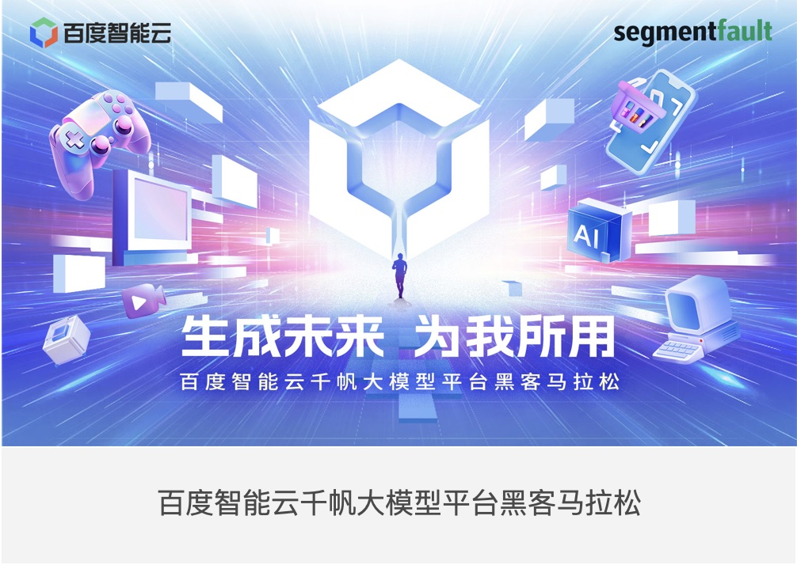
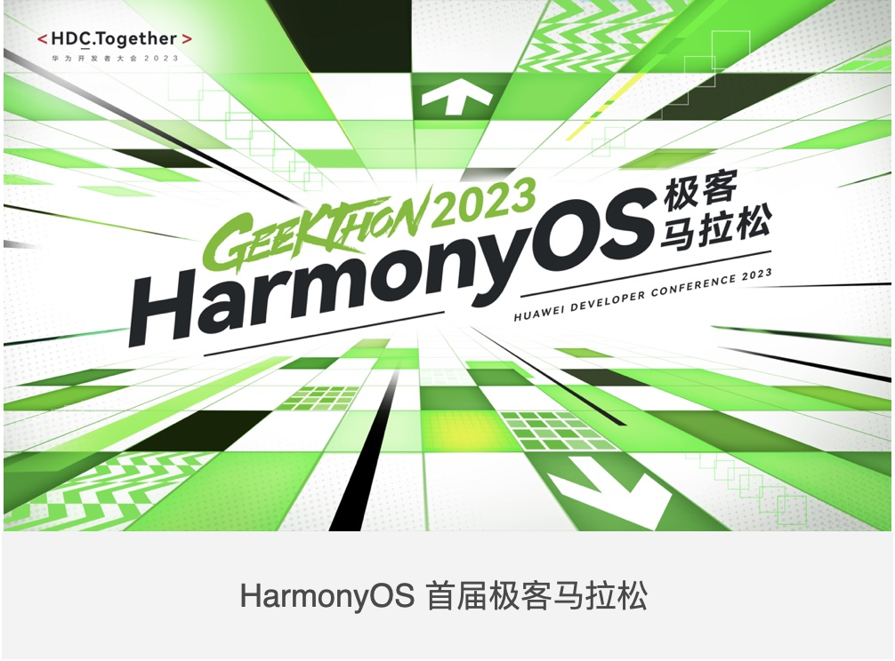
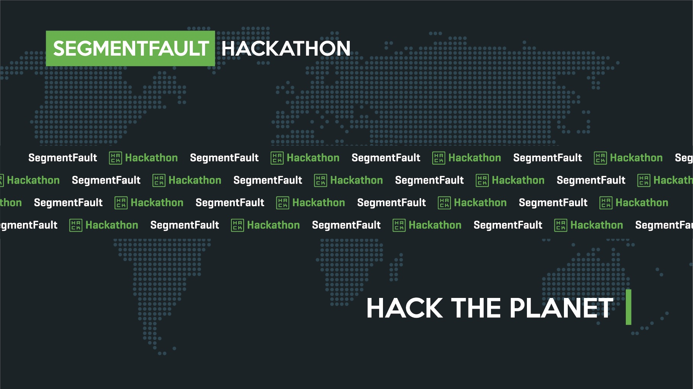
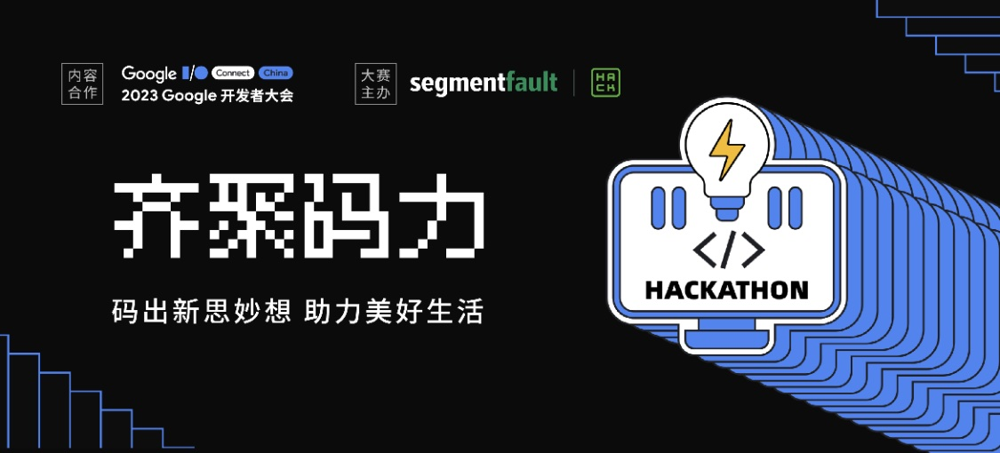
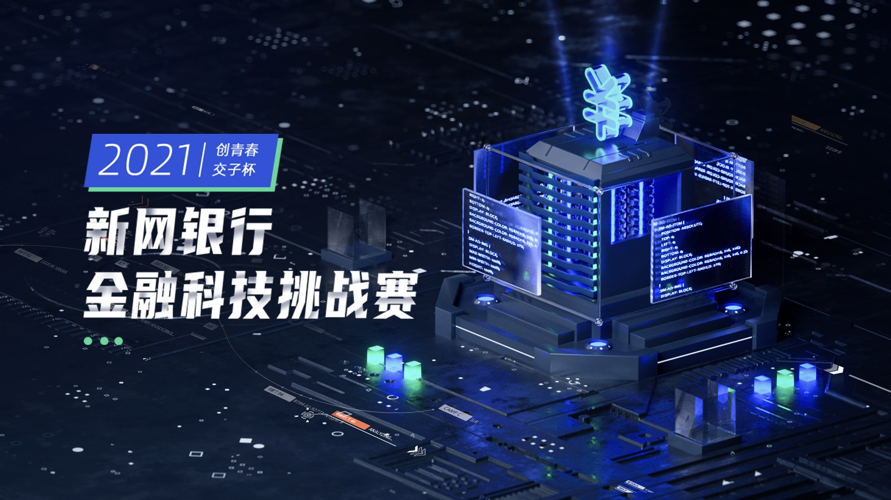

# SegmentFault 如何通过黑客马拉松赋能企业开发者生态？

> Hackathon 一词由 Hack 和 Marathon 组成，中文译为黑客马拉松或编程马拉松，是一种创新的技术竞赛形式。在活动中，要求程序员们相聚在一起，以团队合作的形式进行编程，在 2 天 1 夜中完成一个作品雏形的开发，并进行路演展示。由于在这 30 多个小时内，程序员们常常不眠不休，这种长时间编程对于体力和毅力的挑战与马拉松对长跑运动员的挑战如出一辙，于是被命名为黑客马拉松。 
> Hackathon 最早被 SegmentFault 思否团队引入国内，如今越来越多的企业开始组织内外部黑客马拉松。对于企业而言，举办黑客马拉松，一是传播企业技术品牌或雇主品牌，二是可以广泛征集创意，为产品/技术创造更多可能性，甚至是解决企业中的实际问题，或孵化创新项目。而从开发者的角度，Hackathon 的意义很大程度是让开发者从日常任务中脱离出来，回归初心，通过动手打破现实中的各种束缚，将创新想法变成现实。 SegmentFault 思否作为国内最大的 Hachathon 组织者，在中国十余个城市和新加坡、美国硅谷等地举办了上千场 Hackathon，也承办了如 Google、百度、阿里巴巴、腾讯、亚马逊云科技、声网、招商银行、新网银行等企业发起的黑客马拉松。
> **在这一案例中，我们将剖析不同类型企业举办黑客马拉松的生态价值，并对如何举办黑客马拉松给出我们的建议。**

## 黑客马拉松的不同类型与生态价值

按照举办黑客马拉松的目的，黑客马拉松大体分为三类，分别为：产品推广、品牌传播和生态合作类，我们可以逐一分析它们背后不同的价值。

### 产品推广类黑客马拉松

企业组织黑客马拉松最常见的诉求就是产品推广，这里所说的产品推广类是一个广义的概念。实际上，组织黑客马拉松不仅有助于让更多开发者了解、试用和使用企业的产品，增加产品的曝光率，还为产品的迭代和创新提供了宝贵的洞察，具体包括：

- 通过让开发者在黑客马拉松中使用公司的产品（如 API、SDK 或其他技术工具），企业可以直接获得来自终端用户的反馈，根据开发者在黑客马拉松中的使用体验，企业可以对产品进行改进和优化；
- 开发者可能会以创新的方式使用这些产品，从而挖掘出新的应用场景和潜在市场，对公司进一步迭代产品带来参考方向。PingCAP 就曾在其出版的书籍《与开源同行》中描述其为 “黑客马拉松驱动的公司”，以此来突出黑客马拉松对推动其产品创新起到的巨大作用；
- 同时开发者在黑客马拉松开放的环境下创造的新的应用场景也能为其潜在用户带来启发，激励潜在客户尝试产品，并作为成功案例，增强其他潜在用户的信心。

我们选取了一些这一类型的黑客马拉松案例，供读者参考。

刚刚结束不久的**百度智能云千帆大模型平台黑客马拉松**是这一类别的典型案例。在这一大赛中，来自海内外 40 余个城市地区上千位开发者报名参赛，33 支队伍百余名开发者入围决赛，诞生了 30 个充满想象力的产品 Demo。 黑客马拉松提供了一个低门槛的方式让开发者快速上手体验产品，客观上加速了用户的转化。作为一个年轻的产品，黑客马拉松可以帮助百度千帆在现场收集到开发者对产品使用的一手反馈和优化建议，推动产品迭代。同时，开发者的创造力和想象力可以丰富大模型平台的应用场景，帮助百度智能云进一步拓展产品的下游应用，达到带动业务增长的目的。

作为华为 HDC.Together 华为开发者大会的一部分，**HarmonyOS 首届极客马拉松**在今年 8 月圆满落幕。从上千名选手中脱颖而出的数十名开发者在有限的 36 小时里，运用 HarmonyOS 最新技术进行创新应用开发。HarmonyOS 多端部署、分布式流转、元服务等技术能力被广泛应用于创新应用的构建之中，加速了开发者对鸿蒙最新特性的了解和应用。 同时，黑客马拉松也是企业向开发者传递信任的方式 —— 通过支持选手 24 小时不间断编码完成作品的方式，向开发者证明 HarmonyOS 已经做好了充分准备，从技术的成熟度、开发工具的完善程度都能够支撑开发者的创作和想象力，充分展现了其开发者友好度。 而为了更好地收集开发者意见反馈，建立良好的开发者关系，在大赛现场华为的技术专家们也借机和开发者们进行了深度交流。

**RTE 编程挑战赛**是面向全球 RTE 开发者、高校学生、创业者、极客企业以及个人开发者的在线黑客马拉松，已连续举办多届，旨在鼓励开发者借助声网 SDK 和云市场能力，开发出更多有创意、有价值的实时音视频互动场景和创新应用，拓宽 RTE 技术能力边界。 这场挑战赛不仅是技术能力的较量，也是开发者对声网 RTE 技术潜能的全面探索。大赛期间，开发者们得以深入体验声网技术的前沿功能，如低延迟、高稳定性和多样的交互方式，这些体验直接加深了他们对声网技术的理解和应用。同时，通过大赛创造的多样化应用场景也可以反过来帮助声网拓展产品的应用边界，发现更多创新点。

SegmentFault 思否曾在 2016 和 2018 年先后两次举办微信小程序黑客马拉松。2016 年时，微信小程序尚在内测中，SegmentFault 思否和 ifanr 为开发者提供了少量内测资格，让众多开发者抢先体验并开发出了可用的小程序。作为一个非微信官方的活动，却受到了微信小程序团队极大的关注，开发者们在大赛中发现并反馈了多处体验不佳或存在 Bug 的功能，帮助微信团队在产品内测期就发现并解决了诸多问题。 

2018 年的 **WeGeek 微信小程序黑客马拉松**是微信官方发起的活动，28 小时的线下极速开发后，27 个小程序横空出世。这对发掘小程序的更多应用场景，拓展小程序的使用边界；收集开发者的反馈和建议，以改进小程序的技术细节；丰富小程序的案例库，提供开发参考和借鉴；以及加强微信与开发者的联系，了解开发者的需求和痛点都起到了很大作用。

## 品牌类黑客马拉松

这类黑客马拉松旨在提升公司的品牌形象，包括技术品牌、雇主品牌，以及树立良好的企业社会形象（for Social Impact）等。

### 技术品牌类

相较于开发者大会、技术沙龙和讲座等以单向输出为主的技术活动，黑客马拉松具有更强的互动性，开发者从舞台下的听众成为了这场狂欢中真正的主角，也因此受到了开发者们的广泛追捧。举办黑客马拉松成为拉近公司与开发者的距离，展现企业拥抱创新技术文化的绝佳机会。

技术品牌类的黑客马拉松，最典型的案例便是 **SegmentFault Hackathon**，作为思否自有品牌的黑客马拉松，它甚至比思否的社区更早获得开发者的关注，它有其专有的 Logo，通过超 10 年的运营已经形成了强有力的活动 IP。 黑客马拉松是思否社区的特有文化之一，也是社区用户特别形态的 Meetup，从 10 年前的移动开发、7 年前的小程序开发，到近年来的区块链技术、Gen AI，思否每年会选取当年的热门技术组织黑客马拉松，社区用户从线上走到线下用代码切磋交流，可以有效增强用户场地社区认同感、忠诚度，提升社区活跃。截至目前，已经有超过 20,000+ Hackers 参加过思否的线下黑客马拉松，累计产生了 2,000+ 作品，其中 50+ 件成为创业项目，并获得投资。

很多企业也会将以品牌传播为目的的黑客马拉松与其其他的大型技术活动相结合，比如谷歌已经连续两年在其举办 **Google 开发者大会期间就与 SegmentFault 思否合作带来黑客马拉松的同场活动**。 大会举办期间，开发者们借助 Android、Flutter、Firebase、ChromeOS、TensorFlow、Web、Google Cloud 等来自的 Google 生态的开发工具，围绕应对社会挑战和现实问题的开放式命题进行 32 小时的极限编程挑战。 这是一种极为高效的品牌传播策略，黑客马拉松为开发者大会增添了一种独特的互动和参与性元素，大会的品牌影响力也和黑客马拉松的创新精神相结合，共同提升了整体活动的品牌价值。

#### 雇主品牌类

伴随着黑客马拉松在国内的风靡，它也成为了众多企业塑造雇主品牌、展示其工程师文化，并直接从中发掘和选拔优秀人才的重要方式。同时，潜在的求职者也可以通过黑客马拉松近距离了解目标企业。甚至部分企业直接在大赛中为优秀选手提供工作机会，这种直接的招聘方式对于双方都非常高效。

以百度首届搜索技术创新挑战赛为例，赛程共历时 2 个月，超 1,600 名参赛选手报名参加。通过为选手提供海量学习资源以及工作和实习机会，百度将一次性的竞赛类活动拓展、迭代成了人才培养的加速器，在聚集人才的同时兼顾了人才从遴选到培育、从吸收到输出的加速转化。

与此类似的还有新网银行金融科技挑战赛，在过往几年的大赛中，新网银行在为选手提供高额奖金的同时，还直接为获奖选手（应届毕业生）发放年薪 30 万元的 offer，并为在校生保留 offer 有效期直至其毕业。为了帮助选手加深对川渝地区和新网银行的了解，在赛后其还特别组织了优秀选手参观包括新网银行、成都高新减灾研究所、美幻科技、tap4fun、极米科技等优秀本土企业。

#### 社会价值类

2018 年，腾讯首次喊出 “科技向善” 的企业使命愿景，在随后的几年中，伴随着碳中和、ESG 被更多人关注，越来越多企业开始重视其社会影响。For Public Good 和 Social Impact 也成为了众多企业黑客马拉松的一个常见主题。

由腾讯公益慈善基金会、中国互联网发展基金会主办的 **Light·技术公益创造营**已连续举办三年，聚焦未成年人心理健康、老年人用网安全、生物多样性保护等社会问题。要求选手运用腾讯云的 AI 技术打造一款创新应用或技术解决方案。举办三届以来，已经吸引超过 3,600 支队伍、18,000 名开发者参加，是目前国内最具影响力的技术公益平台之一。在传播和推广腾讯云产品技术的同时，这一大赛对于树立和提升腾讯的企业社会形象也起到了积极作用。

### 生态合作类黑客马拉松
生态合作类黑客马拉松主要致力于加强和生态系统内伙伴（如客户、ISV、上下游伙伴等）的合作关系，共同探索和解决行业问题，创造更多商业价值，鼓励不同公司之间的合作和创新。

**黑客马拉松的目标往往不是单一的，而是交叉存在的**，比如品牌类的黑客马拉松中，齐聚码力黑客马拉松会要求选手使用 Google 的相关技术，腾讯 Light·技术公益创造营会要求选手使用腾讯云的技术，新网银行金融科技挑战赛会要求选手到其小程序上注册报名等等。但一个成功的大赛，往往都有其明确的第一目标，大赛的赛制和规则设计都将围绕此展开，因此作为大赛的主/承办方第一要务便是明确目标。

## 如何举办一场高质量的黑客马拉松
### 一场黑客马拉松的执行流程
#### 前期筹备
* **大赛策划：**
  * 明确大赛目标、预算范围
  * 策划大赛主题：大赛主题策划、主题解读、参赛规则、Slogan 的设计、赛题设计、明确评审标准和流程等
    * 在规则设计上，思否有 2 条黄金铁律
    * 拒绝在黑客马拉松开幕前就已经完成开发甚至已经上线的产品
    * 杜绝 PPT 大赛，产品路演推荐直接展示 Demo，如需 PPT 辅助，则 PPT 不得超过 3 页
  * **项目规划：**定制项目规划表，详细规划每个时间段的事项、任务、负责人等
  * **传播方案：**目标拆解、广告排期、社区合作计划等
* 视觉设计：
  * 大赛主视觉设计及广告素材尺寸延展
  * 大赛官网上线：官网文案内容撰写、官网设计、开发上线
#### 大赛传播招募及选手运营
* **招募目标拆解：即预期分别通过哪些渠道招募到多少选手参赛**
* **传播执行：**
  * 合作社区、媒体洽谈
  * 广告投放 + 定向邀约
  * 效果追踪与策略调整
* **选手运营：这里需要特别注意，选手从报名到来到线下参赛、产出作品，还存在非常大的 gap，我们需要通过选手运营来增加转化率**
  * 帮助没有队伍的选手进行队友匹配
  * 收集选手创意和团队背景信息，对于背景单一的团队给出组队建议
  * 追踪选手组队以及创意提交进度，适时提供帮助
#### 选手资格初筛（如有）及线下黑客马拉松选手入围通知
为了保障选手最佳的参赛体验，SegmentFault Hackathon 会将线下参赛人数规模控制在 35 个团队内，因此对于吸引了较高关注度的比赛，思否会在邀请其来现场参赛前要求其预先提供产品创意和团队背景信息，并进行初审。通过初审的团队将获得一张线下 PASS 卡，代表其拥有了线下参赛的资格。
在项目初审期，SegmentFault Hackathon 主要依据以下几条因素进行初筛：
* 产品创意是否具备可行性，能够在 2 天 1 夜中通过团队协作完成开发，且目前该产品尚未发布上线
* 团队背景是否包含程序员，一些虽然拥有奇思妙想，但没有程序员来完成开发的团队，依旧没有办法入围
* 在以上的基础上 SegmentFault 还会做出综合权衡
入围名单确认后，运营团队会第一时间为通过初筛的选手发去邀请函，确认其能够出席，来保障大赛的到会率。
#### 线下黑客马拉松筹备
* **线下黑客马拉松的物料设计制作**
  * 合影墙、背景板
  * 确保在现场提供充足的技术资源和支持，包括网络、硬件、软件工具等
  * 选手纪念周边（文化衫等）设计制作：文化衫是黑客马拉松的一个非常重要的文化符号，SegmentFault 思否历年 Hackathon 的文化衫都受到了众多开发者的追捧甚至收藏。一个具备 Hack 符号的文化衫设计对于一场成功的黑客马拉松至关重要。
* **现场执行分工**
*  **赛场布置与彩排**
  * 现场搭建、大屏音响灯光测试
  * 流程彩排
#### 线下黑客马拉松执行
#### 赛后收尾工作
* 赛后传播：围绕大赛作品包装、选手访谈、生态价值等展开
* 选手调研：产品体验调研、参赛体验调研
* 奖金/奖品发放
#### 赛后复盘
* 成本决算
* 经验总结

### 思否 2 天 1 夜黑客马拉松的环节设置

| DAY 1         |                            | DAY 2         |                                              |
|---------------|----------------------------|---------------|----------------------------------------------|
| 08:00 - 09:00 | 签到入场                   | 08:00 - 09:00 | 早餐                                         |
| 09:00 - 11:30 | 开幕式：规则说明、启发演讲 | 09:00 - 13:00 | 作品提交 & 路演测试                          |
| 11:30 - 13:00 | 选手组队 & 午餐休息        | 13:00 - 14:00 | 午餐                                         |
| 13:00 - 18:00 | 作品开发                   | 14:00 - 17:00 | 作品路演（每支团队  3 分钟讲解，2 分钟答疑） |
| 18:00 - 19:00 | 晚餐                       | 17:00 - 17:30 | 组委会评分                                   |
| 19:00 - 24:00 | 作品开发 & 夜宵抽奖        | 17:30 - 18:00 | 颁奖典礼 & 自由交流                          |

在 2 天 1 夜的黑客马拉松中，SegmentFault 思否会为选手提供 2 日的午餐，第一天的晚餐、宵夜，和第二天的早餐。除此以外，场内还会有不限量供应的零食、饮料，和限时供应的咖啡、啤酒。

### 黑客马拉松常见的评分标准

- **完成度 - 40%**，参赛团队提供的作品的完整性及完成度，包括代码质量、视觉设计等
- **创意度 - 20%**，参赛作品的创新性，与现有同类产品是否具有差异性
- **实用性 - 20%**，参赛作品是否拥有实际应用场景，是否能够匹配用户的发展诉求，注重用户体验
- **社会价值 & 主题契合度 - 20%**，参赛作品可以在日常工作生活中产生的社会价值，是否能够切合大赛主题，为人们的日常生活带来改变。根据大赛目标和类型的不同，有时也会考虑产品的商业价值。

经过多年的实践积累，思否团队相信黑客马拉松已经成为连接企业与开发者、激发技术创新的一个极佳的平台。它不仅能让开发者尽情发挥创造力，也对企业开发者关系的健康发展起着至关重要的作用。希望上述经验的总结和对于企业举办黑客马拉松生态价值的剖析，可以对读者的工作有所帮助。

SegmentFault 思否期待和更多伙伴共同致力于激发开发者的创造潜能，并共同促进企业开发者生态的持续成长。